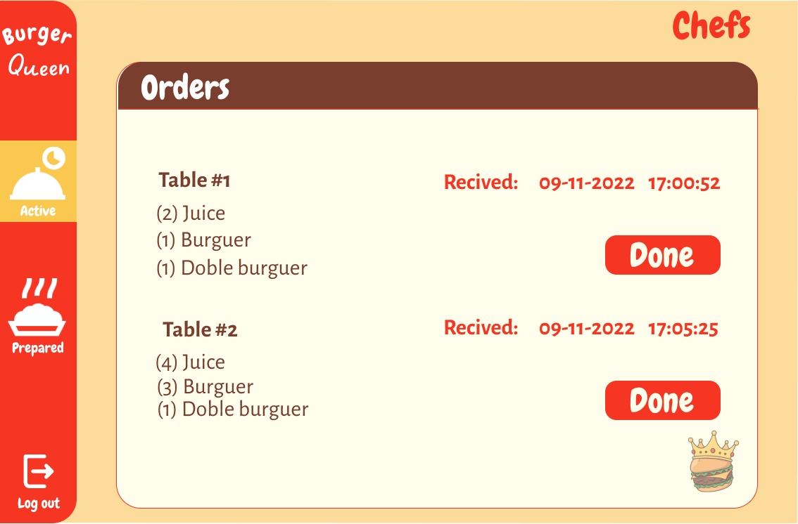

# Burguer Queen

## Índice

* [1. Resumen del proyecto](#1-resumen-del-proyecto)
* [2. Inspiración y diseño](#2-inspiración-y-diseño)
* [3. Historias de usuario](#3-historias-de-usuario)
* [4. Versión final](#4-versión-final)
* [5. Pruebas unitarias](#5-pruebas-unitarias)
* [6. Créditos y Agradecimientos](#6-créditos-y-agradecimientos)

***

## 1. Resumen del proyecto

El objetivo de este proyecto fue desarrollar una aplicación para gestionar un restaurante. M

Las tareas que logramos que maneje la app son la generación de pedidos, notificación de pedidos listos para servir con la interacción de roles  mesero y cocinero, así como organización de trabajadores y productos asignada para el administrador; cada uno de estos diseños solo es accesible para aquellos con los permisos apropiados según su rol en el negocio.

Para hacer posibles las funcionalidades mencionadas, consumimos datos de una mockAPI RESTful y desarrollamos su CRUD, usando `React`.

## 2. Inspiración y Diseño

Comenzamos el proceso de diseño buscando y revisando las aplicaciones web de varios restaurantes de comida rápida para inspirarnos.

La paleta de colores escogida, según los usuarios, está asociada al ámbito de comida e incluso provoca la sensación de hambre.

Al ser una app desarrollada como SPA (Mobile First), priorizando su uso en dispositivos tipo tablet, se consideró la legibilidad del texto, sin dejar de lado el estilo de este último, el tamaño de los botones y entradas, y la intuición de su navegación.

## 3. Historias de usuarios

Se escribierón un total de ocho historias de usuario.

### 1. Inicio de sesión para miembros, incluidos administradores, chefs y meseros.

### 2. Un mesero puede crear y cancelar un nuevo pedido

### 3. Los chefs pueden ver los pedidos pendientes cronológicamente

### y

### 4. Los chefs pueden marcar los pedidos como hechos, una vez completados.

### 5. Los chefs pueden visualizar los pedidos hechos pero pendientes de ser entregados a los clientes por los meseros

### 6. Los meseros pueden visualizar los pedidos listos para ser servidos y marcarlos como entregados a los clientes

### 7. Los administradores pueden visualizar, crear, editar y eliminar miembros del personal de trabajo.

Se muestra un ejemplo del diseño de modales para la confirmación de acciones en la app, este es el modal de agregar un socio.

### 8. Los administradores pueden visualizar, crear, editar y eliminar productos en el almacén.

## 4. Versión final

Para el despliegue de la aplicación web utilizamos la plataforma [Netlify](https://www.netlify.com/).

La versión funcional final de esta aplicación se puede visitar [aquí](https://burgerqueen-bq2.netlify.app/)

## 5. Pruebas unitarias

Para la prueba unitaria de este proyecto, comenzamos a familiarizarnos con [React Testing Library](https://testing-library.com/docs/react-testing-library/intro/). Por esta razón, solo probamos el diseño de inicio de sesión en esta iteración del proyecto.

## 6. Créditos y agradecimientos

Este proyecto fue desarrollado por Gabriela C. Horcasitas, Karla P. Cruz y Lizbeth A. Lopez.

Queremos agradecer a todo el equipo de Laboratoria por el apoyo que nos brindaron en nuestros primeros pasos como desarrolladores.

También queremos reconocer el esfuerzo y cariño de la comunidad estudiantil de la generación MEX013 de Laboratoria, su apoyo fue fundamental en nuestro camino.